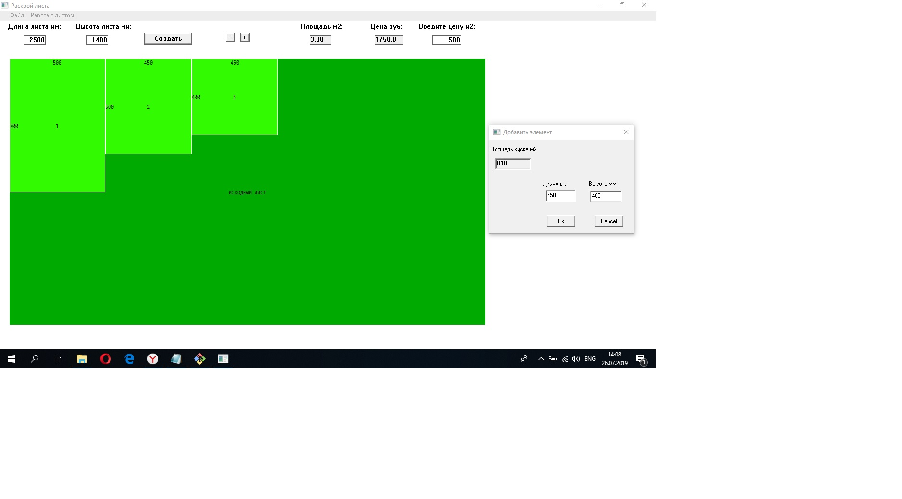

Программа может использоваться для экономного распила листов. Пользователем задаются размеры исходного листа. Затем размеры вырезаемых элементов. Для достижения экономии элементы можно поворачивать на 90 градусов, менять местами и удалять.
Результаты работы можно сохранить в файл.

